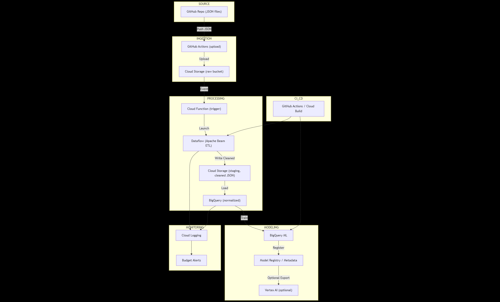

# Soccer Data Pipeline — Architecture & Implementation Guide
---

## Table of contents
1. Overview  
2. Architecture diagram (Mermaid)  
3. Component responsibilities  
4. Data formats & schema  
5. Ingestion (GitHub Actions -> GCS)  
6. Processing (Dataflow ETL)  
7. Storage (GCS staging + BigQuery schemas & partitioning)  
8. Modeling (BigQuery ML + Vertex AI path)  
9. Evaluation & validation strategy  
10. CI/CD, testing & reproducibility  
11. Monitoring, logging & cost controls  
12. Security & IAM  
13. Sample code snippets (GitHub Actions, Dataflow pipeline)  
14. Acceptance criteria checklist  
15. Next steps & rollout  

---

## 1. Overview
This document defines a concrete architecture to ingest JSON match data stored in a GitHub repository into Google Cloud, normalize it, stage it in Cloud Storage, then load it into BigQuery for modeling. The goal: train a reproducible model that predicts the season winner for a given league.

Primary goals:  
- Use **GCP free-tier-friendly services** (BigQuery sandbox, Cloud Storage, Dataflow)  
- Batch-oriented (daily/weekly) and cost-aware  
- Reproducible training and CI/CD to rerun end-to-end jobs on updates  

---

## 2. Architecture diagram (Mermaid)


> Flow: GitHub pushes JSON → GitHub Action uploads to GCS (raw) → Dataflow validates/normalizes to GCS (staging, Parquet/Avro) → BigQuery load → BigQuery ML trains model → CI/CD orchestrates → Cloud Logging & Budget Alerts monitor.

---

## 3. Component responsibilities
- **GitHub repo**: Holds JSON files (`/data/<league>/<season>.json`), schema docs, ETL and model code, CI YAMLs.  
- **GitHub Action (ingest)**: Uploads JSON files to raw GCS bucket.  
- **GCS (raw)**: Immutable raw JSON objects (`raw/<league>/<season>/<file>.json`). Lifecycle policy: purge >1 year.  
- **Dataflow (Apache Beam)**:  
  - Reads raw JSON from GCS.  
  - Validates & normalizes records.  
  - Writes **Parquet/Avro** files into a **staging GCS bucket**.  
  - Optionally triggers a **BigQuery load job** into normalized tables.  
- **GCS (staging)**: Holds validated, structured files (`staging/<date>/<league>/<season>.parquet`).  
- **BigQuery**:  
  - `matches_normalized` (partitioned table).  
  - `season_results` (aggregated).  
- **BigQuery ML**: Train baseline + production models in SQL.  
- **CI/CD**: GitHub Actions or Cloud Build.  
- **Monitoring**: Cloud Logging + Budget Alerts.  

---

## 4. Data formats & schema
### 4.1 Input JSON (sample)
- Matches may have only `ft` (full-time) or both `ht` and `ft`.  
- Some fields missing or inconsistent.  
- Team names inconsistent across seasons.  

### 4.2 Normalized schema (BigQuery target)
| column | type | notes |
|--------|------|-------|
| league | STRING | e.g., "Österr. Bundesliga" |
| season | STRING | e.g., "2010/11" |
| round | STRING | e.g., "Matchday 1" |
| match_date | DATE | parsed from date |
| match_time | STRING | raw if timezone unknown |
| team_home | STRING | standardized |
| team_away | STRING | standardized |
| ht_home | INT64 | nullable |
| ht_away | INT64 | nullable |
| ft_home | INT64 | nullable |
| ft_away | INT64 | nullable |
| winner | STRING | derived |
| points_home | INT64 | derived |
| points_away | INT64 | derived |
| schema_version | STRING | version string |
| source_commit | STRING | Git SHA |
| ingestion_ts | TIMESTAMP | ETL timestamp |

Partition: `DATE(match_date)` or season start date.  
Cluster: `league, team_home, team_away`.  

---

## 5. Ingestion — GitHub Actions -> GCS
**Trigger**: `on: push` (`data/**`)  
**Behavior**:  
- Upload new/changed JSON → `gs://soccer-ingest-raw/<league>/<season>/<filename>.json`.  
- Attach commit SHA metadata.  
**Idempotence**: path includes hash or commit.  

---

## 6. Processing — Dataflow ETL
**Why Dataflow?** Managed, scalable, batch-oriented Apache Beam pipelines.  

**ETL flow per run**:  
1. Triggered by Cloud Function (on GCS upload) or by Cloud Scheduler → Pub/Sub → Dataflow flex template.  
2. For each JSON file:  
   - Read → `PCollection`.  
   - Validate against `schema.json`.  
   - Normalize into row-level match records.  
   - Standardize team names via lookup (`team_aliases`).  
   - Write **Parquet/Avro** to staging bucket (`gs://soccer-staging/…`).  
3. BigQuery load job ingests staging files into `matches_normalized`.  
4. Emit logs (counts, errors).  

**Idempotency**: Include `source_commit` + `file_path` metadata. Dedup in BigQuery.  

**Scaling**: Dataflow autoscaling; cap workers to limit cost.  

---

## 7. Storage — GCS staging + BigQuery
- **Staging**: GCS bucket (`soccer-staging`) with partitioned file paths:  
  ```
  staging/<date>/<league>/<season>.parquet
  ```  
- **BigQuery**: normalized + aggregated tables.  

---

## 8. Modeling
Use **BigQuery ML** initially. Predict champion per season using binary classification.  

Features: rolling averages, previous season performance, etc.  
Eval: top-1 & top-3 accuracy, ROC.  

---

## 9. Evaluation & validation strategy
- Temporal holdout: train ≤ T-2, validate T-1, test T.  
- Walk-forward CV.  
- Baselines: previous champion, points leader.  

---

## 10. CI/CD, testing & reproducibility
- **Repo structure**  
```
/data/
/etl/pipeline.py
/models/
/docs/
/tests/
/.github/workflows/
```  
- **CI workflows**  
  - `ci.yml`: tests + lint.  
  - `ingest.yml`: upload JSON → GCS.  
  - `retrain.yml`: scheduled model retrain.  

---

## 11. Monitoring, logging & cost controls
- **Logging**: Dataflow + BigQuery → Cloud Logging.  
- **Monitoring**: Alerts for Dataflow failures.  
- **Cost control**: cap Dataflow workers; BigQuery `--maximum_bytes_billed`; budgets & alerts.  

---

## 12. Security & IAM
- GitHub SA → GCS write.  
- Cloud Function SA → launch Dataflow jobs.  
- Dataflow worker SA → read raw GCS, write staging, load to BigQuery.  
- Secrets → GitHub Actions secrets or WIF.  

---

## 13. Sample code snippets
### 13.1 GitHub Action (ingest.yml)
```yaml
name: Ingest JSON to GCS
on:
  push:
    paths:
      - 'data/**'

jobs:
  upload:
    runs-on: ubuntu-latest
    steps:
      - uses: actions/checkout@v4
      - name: Upload JSON to GCS
        uses: google-github-actions/upload-cloud-storage@v1
        with:
          path: 'data/**.json'
          destination: 'gs://soccer-ingest-raw/'
```

### 13.2 Dataflow pipeline skeleton (`etl/pipeline.py`)
```python
import apache_beam as beam
from apache_beam.options.pipeline_options import PipelineOptions
import json

class ParseMatches(beam.DoFn):
    def process(self, element, commit_sha):
        record = json.loads(element)
        for match in record.get("matches", []):
            yield {
                "league": record.get("name"),
                "season": record.get("season"),
                "round": match.get("round"),
                "match_date": match.get("date"),
                "team_home": match.get("team1"),
                "team_away": match.get("team2"),
                "ft_home": match.get("score", {}).get("ft", [None, None])[0],
                "ft_away": match.get("score", {}).get("ft", [None, None])[1],
                "source_commit": commit_sha,
            }

def run(argv=None):
    options = PipelineOptions(save_main_session=True, streaming=False)
    with beam.Pipeline(options=options) as p:
        (
            p
            | "ReadFromGCS" >> beam.io.ReadFromText("gs://soccer-ingest-raw/*.json")
            | "ParseJSON" >> beam.ParDo(ParseMatches(), commit_sha="abc123")
            | "WriteToGCS" >> beam.io.WriteToParquet(
                file_path_prefix="gs://soccer-staging/matches",
                schema={
                    "fields": [
                        {"name": "league", "type": "STRING"},
                        {"name": "season", "type": "STRING"},
                        {"name": "round", "type": "STRING"},
                        {"name": "match_date", "type": "STRING"},
                        {"name": "team_home", "type": "STRING"},
                        {"name": "team_away", "type": "STRING"},
                        {"name": "ft_home", "type": "INT64"},
                        {"name": "ft_away", "type": "INT64"},
                        {"name": "source_commit", "type": "STRING"},
                    ]
                }
            )
        )

if __name__ == "__main__":
    run()
```

---

## 14. Acceptance criteria checklist
- [ ] GitHub Action → GCS ingestion.  
- [ ] Dataflow ETL → GCS staging.  
- [ ] BigQuery load from staging.  
- [ ] `matches_normalized` & `season_results` tables created.  
- [ ] BigQuery ML model reproducible.  
- [ ] CI/CD tested.  
- [ ] Monitoring + budget alerts.  

---

## 15. Next steps & rollout
1. Enable GCS, BigQuery, Dataflow APIs.  
2. Create raw + staging GCS buckets.  
3. Add GH Action for ingestion.  
4. Deploy Dataflow pipeline.  
5. Load staging → BigQuery.  
6. Train & evaluate BigQuery ML model.  
